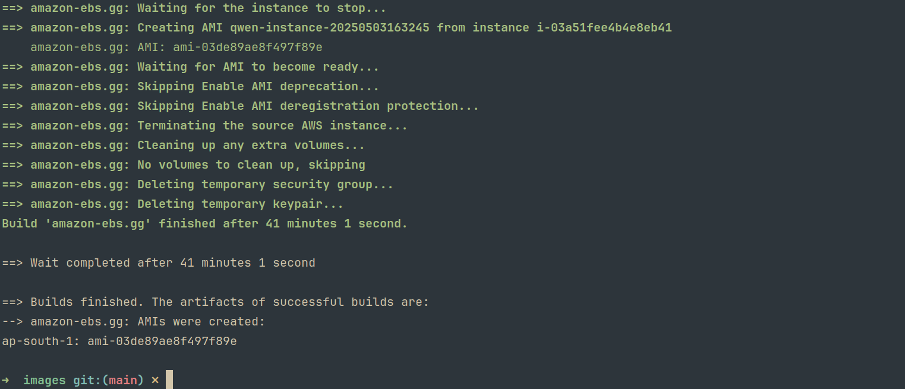

how to build the image

> [!NOTE]
> Make sure you update the `ssh_keys/key.pub`

```bash
packer init image.pkr.hcl

packer build -var region=ap-south-1 -var instance_type=t3.large image.pkr.hcl
```

> [!IMPORTANT]
> the ebs volume size is same when deployed
> 
> Make necessary changes for region and instancetype
> Also the region is where you will use the ami

